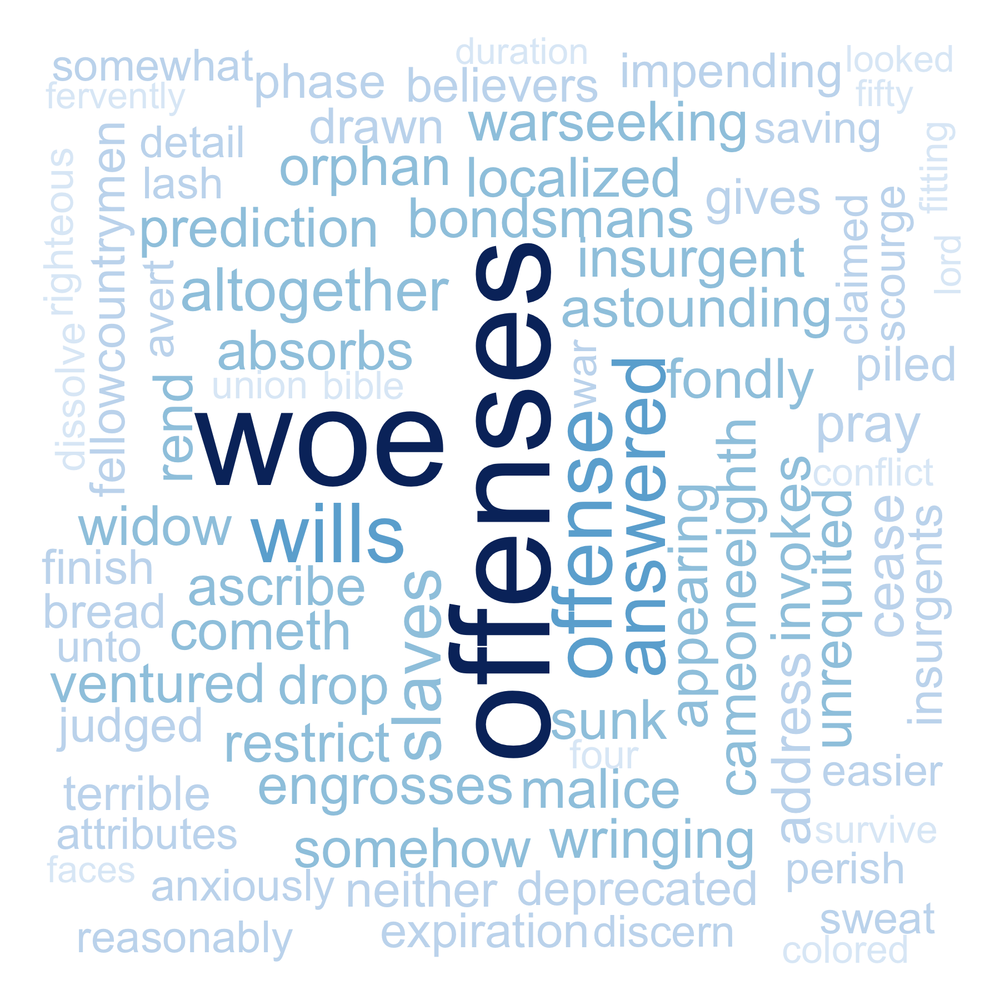

# Step 0: check and install needed packages.
```{r, message=FALSE, warning=FALSE}
packages.used=c("rvest", "tibble", "qdap", 
                "sentimentr", "gplots", "dplyr",
                "tm", "syuzhet", "factoextra", 
                "beeswarm", "scales", "RColorBrewer",
                "RANN", "tm", "topicmodels",
                "wordcloud", "RColorBrewer", 
                "tidytext"
                )

# check packages that need to be installed.
packages.needed=setdiff(packages.used, 
                        intersect(installed.packages()[,1], 
                                  packages.used))
# install additional packages
if(length(packages.needed)>0){
  install.packages(packages.needed, dependencies = TRUE)
}

# load packages
library("rvest")
library("tibble")
library("qdap")   # a lot of utility for text mining
library("sentimentr")
library("gplots")
library("dplyr")
library("tm")
library("syuzhet")
library("factoextra")
library("beeswarm")
library("scales")
library("RColorBrewer")
library("RANN")
library("topicmodels")
library("wordcloud")
library("RColorBrewer") 
library("tidytext")

source("../lib/plotstacked.R")      #!!!!!!!!!!!!!!!!!!!!!!!!!!
source("../lib/speechFuncs.R")         #contain funs
```


This notebook was prepared with the following environmental settings.

```{r}
print(R.version)       #~for reproducibility
```

# Step 1: Data harvest: scrap speech URLs from <http://www.presidency.ucsb.edu/>.
```{r, message=FALSE, warning=FALSE}
### Inauguaral speeches
main.page <- read_html(x = "http://www.presidency.ucsb.edu/inaugurals.php")
# Get link URLs
# f.speechlinks is a function for extracting links from the list of speeches. 
inaug=f.speechlinks(main.page)
#head(inaug)
#as.Date(inaug[,1], format="%B %e, %Y")
inaug=inaug[-nrow(inaug),] # remove the last line, irrelevant due to error.
```

# Step 2: Using speech metadata posted on <http://www.presidency.ucsb.edu/>, we prepared CSV data sets for the speeches we will scrap. 
```{r}
inaug.list=read.csv("../data/InaugurationInfo.csv", stringsAsFactors = FALSE, header=TRUE, sep=";")
speech.list <- cbind(inaug.list, inaug$links)
colnames(speech.list)[6] <- "Dates"
```


```{r, message=FALSE, warning=FALSE}
filenames1 <- paste(speech.list$File, speech.list$Term, sep="-")
filenames <- paste("inaug",filenames1,".txt", sep="")

speech.list$fulltext=NA
for(i in seq(nrow(speech.list))){
  speech<-paste(readLines(paste("../data/InauguralSpeeches/",filenames[i],sep = ""), n=-1, skipNul=TRUE))
  speech.list$fulltext[i]<-speech
}

colnames(speech.list)[7] <- "Fulltext"
```


#By examing the data, I correct the trump's inaugral speech fulltext
```{r}
speech<-paste(readLines(paste("../data/InauguralSpeeches/",filenames[58],sep = ""), n=-1, skipNul=TRUE))
speech.list$Fulltext[58] <- paste(speech, collapse = " ")
speech.list$Words <- NULL
```


# Step 4: data Processing --- generate list of sentences

We will use sentences as units of analysis for this project, as sentences are natural languge units for organizing thoughts and ideas. For each extracted sentence, we apply sentiment analysis using [NRC sentiment lexion](http://saifmohammad.com/WebPages/NRC-Emotion-Lexicon.htm). "The NRC Emotion Lexicon is a list of English words and their associations with eight basic emotions (anger, fear, anticipation, trust, surprise, sadness, joy, and disgust) and two sentiments (negative and positive). The annotations were manually done by crowdsourcing."

We assign an sequential id to each sentence in a speech (`sent.id`) and also calculated the number of words in each sentence as *sentence length* (`word.count`).

```{r, message=FALSE, warning=FALSE}
sentence.list=NULL
for(i in 1:nrow(speech.list)){
  sentences=sent_detect(speech.list$Fulltext[i],
                        endmarks = c("?", ".", "!", "|",";"))
  if(length(sentences)>0){
    emotions=get_nrc_sentiment(sentences)
    word.count=word_count(sentences)   #~ from qdap
    # colnames(emotions)=paste0("emo.", colnames(emotions))
    # in case the word counts are zeros?
    emotions=diag(1/(word.count+0.01))%*%as.matrix(emotions)  #~get the emotion value for word in average
    sentence.list=rbind(sentence.list, 
                        cbind(speech.list[i,-ncol(speech.list)],
                              sentences=as.character(sentences), 
                              word.count,
                              emotions,
                              sent.id=1:length(sentences)
                              )
    )
  }
}
```

Some non-sentences exist in raw data due to erroneous extra end-of sentence marks. 
```{r}
sentence.list=
  sentence.list%>%
  filter(!is.na(word.count)) 

```


# My own analysis
```{r}
sentence.list$post1<- ifelse(sentence.list$positive>=sentence.list$negative,1,0) # if positive  negative, then 1. O.W :0
colnames(sentence.list)[ncol(sentence.list)] <- "PostOne"
points <- NULL
for(i in 1:length(filenames)){
  points <- c(points, mean(sentence.list$PostOne[paste(sentence.list$File,sentence.list$Term,sep="-") == filenames1[i]]))
}
```


#plotting the positive rates with time series
```{r}
ts <- seq(from=1789, to=2017, length.out = length(points))
prate <- as.numeric(points)
df <- data.frame(ts, prate) 
ggplot(df,aes(x=ts,y=prate)) + geom_line(color=rgb(65,105,225,maxColorValue = 255)) + geom_point(shape=8, color=rgb(46,139,87,maxColorValue = 255)) + ggtitle("Positive Rates of Inaugural Speech in Time Series") + labs(x="Year",y="Positive Rate") + geom_smooth()
```


```{r}
collections<-group_by(sentence.list, File, Term)
(tables <- summarise(collections, positive_rate = mean(PostOne, na.rm = TRUE)) %>% arrange(positive_rate))
```

We can see above top ten presidents with least positive rate.


I am trying to show you the top ten wordclouds for analysis later
```{r}
folder.path="../data/InauguralSpeeches/"
speeches=list.files(path = folder.path, pattern = "*.txt")
prex.out=substr(speeches, 6, nchar(speeches)-4)

ff.all<-Corpus(DirSource(folder.path))


ff.all<-tm_map(ff.all, stripWhitespace) %>% tm_map(content_transformer(tolower)) %>% tm_map(removeWords, stopwords("english")) %>% tm_map(removeWords, character(0)) %>%  tm_map(removePunctuation)
```


```{r, message=FALSE, warning=FALSE}
dtm <- DocumentTermMatrix(ff.all,
                          control = list(weighting = function(x)
                                             weightTfIdf(x, 
                                                         normalize =FALSE),
                                                          stopwords = TRUE))
ff.dtm=tidy(dtm)

names1 <- as.character(apply( as.data.frame(select(tables, File, Term))[1:10,] , 1 , paste , collapse = "-" ))
names <- paste("inaug", names1, ".txt", sep="")

for(i in 1:10){
  png(paste("../output/",names1[i],".png", sep=""), width=6, height=6, units="in", res=300)
  
  terms<-ff.dtm$term[ff.dtm$document == names[i]]
  counts<-ff.dtm$count[ff.dtm$document == names[i]]
  wordcloud(terms, counts,
          scale=c(5,0.5),
          max.words=100,
          min.freq=1,
          random.order=FALSE,
          rot.per=0.3,
          use.r.layout=T,
          random.color=FALSE,
          colors=brewer.pal(9,"Blues"))
  
  dev.off()
}
```


<center>
<div style="width:300px; height=300px">

</div>

Comments:!!!!!!!!!!!!!!!!

<div style="width:300px; height=300px">


</div>

Comments:&&&&&&&&&&&&&&&&&&
</center>


```{r}
print("AbrahamLincoln-first-term")
speech.df=as_tibble(sentence.list)%>%
  filter(File=="AbrahamLincoln", Term==1,word.count>=4)%>%
  select(negative)
speech.df <- as.data.frame(speech.df)
speech.df$wordOrder <- 1:nrow(speech.df) 
colnames(speech.df)[2] <- "wordOrder"
ggplot(speech.df, aes(x=wordOrder,y=negative)) + geom_line()
```

```{r}
speech.df=as_tibble(sentence.list)%>%
  filter(File=="AbrahamLincoln", Term==1, PostOne==0,word.count>=4)%>%
  select(sentences, negative)
arrange(speech.df, desc(negative))
#> ggplot(speech.df, aes(x=1:nrow(speech.df), y=speech.df$anger))+geom_line(color="red")
```


```{r}
print("AbrahamLincoln-second-term")
speech.df=as_tibble(sentence.list)%>%
  filter(File=="AbrahamLincoln", Term==2,word.count>=4)%>%
  select(negative)
speech.df <- as.data.frame(speech.df)
speech.df$wordOrder <- 1:nrow(speech.df) 
colnames(speech.df)[2] <- "wordOrder"
ggplot(speech.df, aes(x=wordOrder,y=negative)) + geom_line()
```


```{r}
speech.df=as_tibble(sentence.list)%>%
  filter(File=="AbrahamLincoln", Term==2, PostOne==0,word.count>=4)%>%
  select(sentences, negative)
arrange(speech.df, desc(negative))
#> ggplot(speech.df, aes(x=1:nrow(speech.df), y=speech.df$anger))+geom_line(color="red")
```


