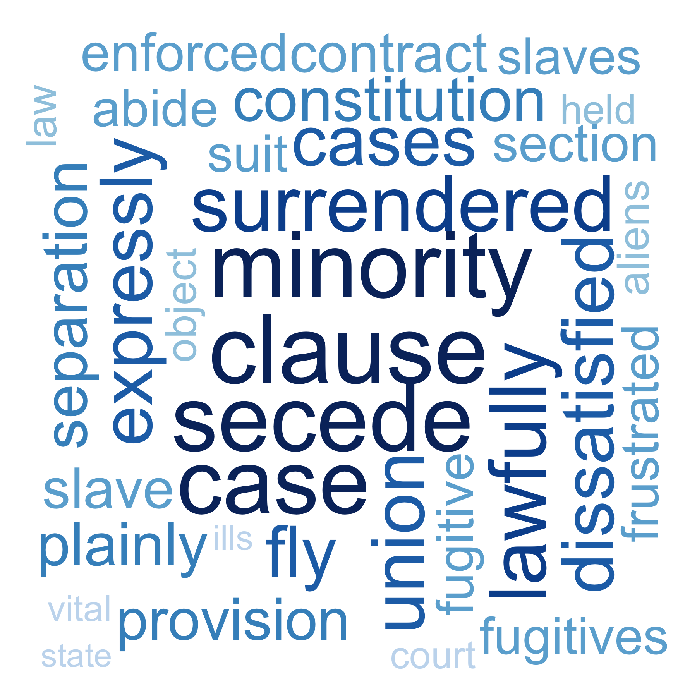

# Step 0: check and install needed packages.
```{r, message=FALSE, warning=FALSE}
packages.used=c("rvest", "tibble", "qdap", 
                "sentimentr", "gplots", "dplyr",
                "tm", "syuzhet", "factoextra", 
                "beeswarm", "scales", "RColorBrewer",
                "RANN", "tm", "topicmodels",
                "wordcloud", "RColorBrewer", 
                "tidytext"
                )

# check packages that need to be installed.
packages.needed=setdiff(packages.used, 
                        intersect(installed.packages()[,1], 
                                  packages.used))
# install additional packages
if(length(packages.needed)>0){
  install.packages(packages.needed, dependencies = TRUE)
}

# load packages
library("rvest")
library("tibble")
library("qdap")   # a lot of utility for text mining
library("sentimentr")
library("gplots")
library("dplyr")
library("tm")
library("syuzhet")
library("factoextra")
library("beeswarm")
library("scales")
library("RColorBrewer")
library("RANN")
library("topicmodels")
library("wordcloud")
library("RColorBrewer") 
library("tidytext")

source("../lib/speechFuncs.R")        
```


This notebook was prepared with the following environmental settings.

```{r}
print(R.version)    
```

# Step 1: Data harvest: scrap speech URLs from <http://www.presidency.ucsb.edu/>.
```{r, message=FALSE, warning=FALSE}
### Inauguaral speeches
main.page <- read_html(x = "http://www.presidency.ucsb.edu/inaugurals.php")
# Get link URLs
# f.speechlinks is a function for extracting links from the list of speeches. 
inaug=f.speechlinks(main.page)
#head(inaug)
#as.Date(inaug[,1], format="%B %e, %Y")
inaug=inaug[-nrow(inaug),] # remove the last line, irrelevant due to error.
```


# Step 2: Using speech metadata posted on <http://www.presidency.ucsb.edu/>, we prepared CSV data sets for the speeches we will scrap. 
```{r}
inaug.list=read.csv("../data/InaugurationInfo.csv", stringsAsFactors = FALSE, header=TRUE, sep=";")
speech.list <- cbind(inaug.list, inaug$links)
colnames(speech.list)[6] <- "Dates"
```


Here, we start reading full inaugural speeches (total 58) into our speech.list data frame for preparing next step.
```{r, message=FALSE, warning=FALSE}
filenames1 <- paste(speech.list$File, speech.list$Term, sep="-")
filenames <- paste("inaug",filenames1,".txt", sep="")

speech.list$fulltext=NA

for(i in seq(nrow(speech.list))){
  speech<-paste(readLines(paste("../data/InauguralSpeeches/",filenames[i],sep = ""), n=-1, skipNul=TRUE))
  speech.list$fulltext[i]<-speech
}

colnames(speech.list)[7] <- "Fulltext"
```


After examing the data, I correct the Trump's inaugral speech fulltext and cancel original words count out.
```{r}
speech<-paste(readLines(paste("../data/InauguralSpeeches/",filenames[58],sep = ""), n=-1, skipNul=TRUE))
speech.list$Fulltext[58] <- paste(speech, collapse = " ")
speech.list$Words <- NULL
```


# Step 4: data Processing --- generate list of sentences

I will use sentences as units of analysis for this project, as sentences are natural languge units for organizing thoughts and ideas. For each extracted sentence, I apply sentiment analysis using [NRC sentiment lexion](http://saifmohammad.com/WebPages/NRC-Emotion-Lexicon.htm). "The NRC Emotion Lexicon is a list of English words and their associations with eight basic emotions (anger, fear, anticipation, trust, surprise, sadness, joy, and disgust) and two sentiments (negative and positive). The annotations were manually done by crowdsourcing."

I assign an sequential id to each sentence in a speech (`sent.id`) and also calculated the number of words in each sentence as *sentence length* (`word.count`).

```{r, message=FALSE, warning=FALSE}
sentence.list=NULL
for(i in 1:nrow(speech.list)){
  sentences=sent_detect(speech.list$Fulltext[i],
                        endmarks = c("?", ".", "!", "|",";"))
  if(length(sentences)>0){
    emotions=get_nrc_sentiment(sentences)
    word.count=word_count(sentences)   
    # in case the word counts are zeros?
    emotions=diag(1/(word.count+0.01))%*%as.matrix(emotions)  #get the emotion value for word in average
    sentence.list=rbind(sentence.list, 
                        cbind(speech.list[i,-ncol(speech.list)],
                              sentences=as.character(sentences), 
                              word.count,
                              emotions,
                              sent.id=1:length(sentences)
                              )
    )
  }
}
```


Some non-sentences exist in raw data due to erroneous extra end-of sentence marks. 
```{r}
sentence.list=
  sentence.list%>%
  filter(!is.na(word.count)) 

```


# Step 5: Data analysis --- sentiment analsis & word cloud

Basically what I do below is add one more column called `PostOne` which stands for the final result about whether this sentence is positive or negative. In other words, if positive rate is bigger than or equal to negative rate, I assign this value as 1. Otherwise, it will be 0 instead.
```{r}
sentence.list$post1<- ifelse(sentence.list$positive>=sentence.list$negative,1,0) # if positive >= negative, then 1. Otherwise, then 0
colnames(sentence.list)[ncol(sentence.list)] <- "PostOne"
```


The codes I type below is for calculating positive rates for each presidents with their unqiue term.
```{r}
points <- NULL
for(i in 1:length(filenames)){
  points <- c(points, mean(sentence.list$PostOne[paste(sentence.list$File,sentence.list$Term,sep="-") == filenames1[i]]))
}
```


Plot the positive rates with time series, from that of George Washington to that of Donald Trump.
```{r}
ts <- seq(from=1789, to=2017, length.out = length(points))
prate <- as.numeric(points)
df <- data.frame(ts, prate) 
ggplot(df,aes(x=ts,y=prate)) + geom_line(color=rgb(65,105,225,maxColorValue = 255)) + geom_point(shape=8, color=rgb(46,139,87,maxColorValue = 255)) + ggtitle("Positive Rates of Inaugural Speech in Time Series") + labs(x="Year",y="Positive Rate") + geom_smooth()
```


Based on above ggplot, we can brefily see there exists a pattern about positive rates with timeline. It firstly goes down. And It goes up gradually. Rectenlt, it starts goes down. This plot is quite reasonble. Firstly, since the American society had a new life at the begining of 1800, the postive rate is relatively higher than following years. It goes extremely low as time goes to around 1860 since American suffered American Civil War. If we take the case of recent timestamp, it shows us downward trend because there was an Economic Depression that strated around 2008. In addition, American society was torn in terms of new Presiedent Trump because a half of American support Hillary and a half of People support for Donald.


Below codes are intended for showing the order of positive rates for each inaugural speech from least to most.
```{r}
collections<-group_by(sentence.list, File, Term)
(tables <- summarise(collections, positive_rate = mean(PostOne, na.rm = TRUE)) %>% arrange(positive_rate))
```
We can directly see above top ten presidents with least positive rate. It display Abraham Lincoln at term 1 and 2, James Madison at term 2, Warren G Harding at term 1, William Henry Harrison at term 1, James K Polk at term 1, James Garfield at term 1, Barack Obama at term 1, Grover Cleveland-II at term 2, John F Kennedy at term 1. However, I am only focusing on AbrahamLincolin at term 1 and 2 in this project since his inaugural speeches reveal the most negative emotions among all of 58 inaugural speeches.


#Wordcloud

I read into the speeches and tidy the dataset. For the speeches, I remove extra white space, convert all letters to the lower case, remove [stopwords](https://github.com/arc12/Text-Mining-Weak-Signals/wiki/Standard-set-of-english-stopwords), removed empty words due to formatting errors, and remove punctuation.

```{r}
folder.path="../data/InauguralSpeeches/"
speeches=list.files(path = folder.path, pattern = "*.txt")
prex.out=substr(speeches, 6, nchar(speeches)-4)

ff.all<-Corpus(DirSource(folder.path))
ff.all<-tm_map(ff.all, stripWhitespace) %>% tm_map(content_transformer(tolower)) %>% tm_map(removeWords, stopwords("english")) %>% tm_map(removeWords, character(0)) %>%  tm_map(removePunctuation)
```


Compute TF-IDF weighted document-term matrices for individual speeches. 
As I would like to identify interesting words for each inaugural speech, I use [TF-IDF](https://en.wikipedia.org/wiki/Tf%E2%80%93idf) to weigh each term within each speech. It highlights terms that are more specific for a particular speech. 
In addition, below codes help me generate top ten wordclouds in negative part and they will be saved under output directory. I will use them for analysis later.

```{r, message=FALSE, warning=FALSE}
# establish TF-IDF weighted document-term matrices
dtm <- DocumentTermMatrix(ff.all,
                          control = list(weighting = function(x)
                                             weightTfIdf(x, 
                                                         normalize =FALSE),
                                                          stopwords = TRUE))
ff.dtm=tidy(dtm)

names1 <- as.character(apply( as.data.frame(select(tables, File, Term))[1:10,] , 1 , paste , collapse = "-" ))
names <- paste("inaug", names1, ".txt", sep="")

# generate ten wordclouds
for(i in 1:10){
  png(paste("../output/",names1[i],".png", sep=""), width=6, height=6, units="in", res=300)
  
  terms<-ff.dtm$term[ff.dtm$document == names[i]]
  counts<-ff.dtm$count[ff.dtm$document == names[i]]
  wordcloud(terms, counts,
          scale=c(5,0.5),
          max.words=100,
          min.freq=1,
          random.order=FALSE,
          rot.per=0.3,
          use.r.layout=T,
          random.color=FALSE,
          colors=brewer.pal(9,"Blues"))
  
  dev.off()
}
```


<center>
<div style="width:300px; height=300px">

</div>
</center>

At the inaugural speech for Abraham Lincoln in first term, we can see some most frequent words such as minority, secede, slave, dissatisfied, surrendered, anarchy and so on and so forth. Based on these words, it is reasonble to imagine how angry and sad Abraham was. The timing when this speech was delivered was the eve of the Civil War. Abraham Lincolin, as the leader of The North, advocated for granting civil rights to freed salaves throughout the country against the claim that American should keep their states' right to perpetual slavery and its expansion in the Aermicas. As [Thirteenth Amendment to the United States Constitution](https://en.wikipedia.org/wiki/Thirteenth_Amendment_to_the_United_States_Constitution) said, "neither slavery nor involuntary servitude, except as a punishment for crime whereof the party shall have been duly convicted, shall exist within the United States, or any place subject to their jurisdiction." 


<center>
<div style="width:300px; height=300px">

</div>
</center>

At the inaugural speech for Abraham Lincoln in first term, we can see some most frequent words such as offenses, woe, slaves, insurgent, malice, orphan, widow and so on. At the ending period of the Civil War, Abraham Lincoln began his second term and delivered this speech. At that time, the Confederacy was nearly collapsed, slavery was freed in the near future. However, the whole of American was experiencing the Reconstruction Era. As the result of four years Civil War, over half million of soliders were dead and much of the South's infrastructure was destroyed. It is still sad memory in American memory until nowadays. A lot of kids became orphan and a number of women became widow. Hence, it is not hard to understand this speech delivered by Lincolin at 3/4/1865 gave away such sad,angry and relatively negative sentiment.


Plot the neagtive rate graph for Abraham Lincoln with his first term
```{r}
print("AbrahamLincoln-first-term")
speech.df=as_tibble(sentence.list)%>%
  filter(File=="AbrahamLincoln", Term==1,word.count>=4)%>%
  select(negative)
speech.df <- as.data.frame(speech.df)
speech.df$wordOrder <- 1:nrow(speech.df) 
colnames(speech.df)[2] <- "wordOrder"
ggplot(speech.df, aes(x=wordOrder,y=negative)) + geom_line(color="red") + labs(x="Sentence Flow", y="Negative Rate") + ggtitle("Negative Rates of Inaugural Speech along with Sentence Flow")+geom_point(color="blue")
```


Based on above graph, we can see that there is a big emotional flunctuation in his first inaugural speech. The negative rate reaches peek nearly at the end of speech. 


Try to find top ten negative rated senetnces
```{r}
speech.df=as_tibble(sentence.list)%>%
  filter(File=="AbrahamLincoln", Term==1, PostOne==0,word.count>=4)%>%
  select(sentences, negative)
arrange(speech.df, desc(negative))
```
The most three neagtive ones: 
1: "The Government will not assail 'you'." 
2: "Whoever rejects it does of necessity fly to anarchy or to despotism."
3: "Suppose you go to war, you can not fight always;"

All of such sentences reflect the situation which American Society was suffering at the eve of the Civil War. There was a incoming war and nobody can stay far away from this swirl. It claims that he advocated for abolishing slavery, strengthening the federal government, and modernizing the capital economy.


Plot the neagtive rate graph for Abraham Lincoln with his second term
```{r}
print("AbrahamLincoln-second-term")
speech.df=as_tibble(sentence.list)%>%
  filter(File=="AbrahamLincoln", Term==2,word.count>=4)%>%
  select(negative)
speech.df <- as.data.frame(speech.df)
speech.df$wordOrder <- 1:nrow(speech.df) 
colnames(speech.df)[2] <- "wordOrder"

ggplot(speech.df, aes(x=wordOrder,y=negative)) + geom_line(color="red") + labs(x="Sentence Flow", y="Negative Rate") + ggtitle("Negative Rates of Inaugural Speech along with Sentence Flow")+geom_point(color="blue")
```


Based on above graph, we can see also that there is a big emotional flunctuation in his second inaugural speech. The negative rate reaches peek nearly at the end of speech. 


Try to find top ten negative rated senetnces
```{r}
speech.df=as_tibble(sentence.list)%>%
  filter(File=="AbrahamLincoln", Term==2, PostOne==0,word.count>=4)%>%
  select(sentences, negative)
arrange(speech.df, desc(negative))
```
Although this second speech is very short, the core idea does not change. From above negative sentences, we can see that Abraham does not like the war and think it is a woe or disaster unto the world. However, the Civil War was fighting for freedom of slavery and for better civil world. He anticipated that the United Stats would be united again and the insurgence would be suppressed. 


# Step 6: Final Conclusion
By exploring the texts of U. S. presidents' inaugural speeches, from that of George Washington to that of Donald Trump, there is an interesting fluctuation among the positive rates among 58 total inaugural speech. Unfortunaelt, the speeches given by President Lincoln were top two. Hence President Lincoln is the president who give away most negative emotion during inaugural speech period without any doubt. By analyzing thoroughly his two inaugural speeches, I find that the whole point of his speeches are advocating for abolishing the slavery, strengthening the power of nation, establishing advanced social mechanism for economic development. In addition, we can see that he personally hated war and thought it as a woe that destroyed the infrastructure, splited families, and broke up whole nation.


